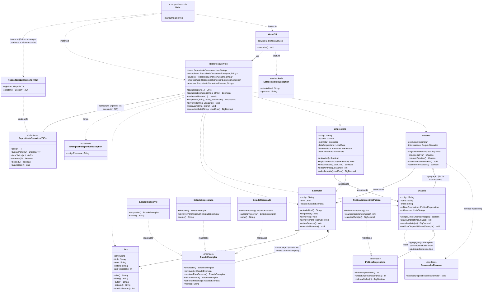

# Diagrama de Classes UML — Sistema de Biblioteca

Fonte de verdade: gerado a partir do código em `origin/main` em 2026-07-12
(commit `d488a59`, após integração da persistência/exceções do Matheus e da
camada de aplicação/interface do P3).

Pendência conhecida de integração: `EstadoExemplar` (P1) ainda lança
`UnsupportedOperationException` como placeholder nas transições inválidas —
`ExemplarIndisponivelException`/`EstadoInvalidoException` ainda não estão
efetivamente conectadas ali (ver TODOs no arquivo). `BibliotecaServico` já foi
escrito assumindo essa conexão (declara `throws ExemplarIndisponivelException`),
então nenhuma mudança será necessária neste pacote quando isso for corrigido.

## Notas de leitura

- **Composição** (`Exemplar *-- EstadoExemplar`): o estado não tem sentido nem
  ciclo de vida fora do exemplar ao qual pertence — quando o exemplar some, o
  estado some junto.
- **Agregação** (`Usuario o-- PoliticaEmprestimo`, `Reserva o-- Usuario`): a
  política pode ser um singleton compartilhado por todos os usuários do mesmo
  tipo (aluno/professor/comunidade), e um `Usuario` numa fila de reserva
  continua existindo e sendo usado em outros contextos independente da
  `Reserva`.
- **Associação simples** (`Exemplar --> Livro`, `Emprestimo --> Usuario`,
  `Emprestimo --> Exemplar`, `Reserva --> Exemplar`): referência sem posse de
  ciclo de vida.
- **Realização** (linhas tracejadas com seta vazada `..|>`): toda
  implementação de contrato (State, Strategy, Observer) aparece aqui — é o
  mecanismo central de Late Binding que a defesa oral deve explicar.
- **Agregação** (`BibliotecaServico o-- RepositorioGenerico`): os repositórios
  são injetados via construtor (Inversão de Dependência) — `BibliotecaServico`
  não cria nem é dono do ciclo de vida deles.
- `Main` é a raiz de composição: é a única classe de todo o sistema que
  conhece `RepositorioEmMemoria` (implementação concreta). Trocar por
  persistência em arquivo/BD significa mudar apenas esta classe.
